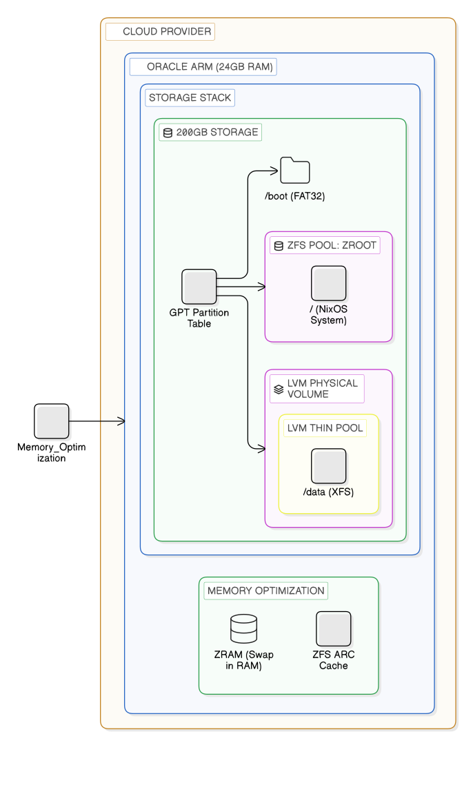

= Oracle Cloud NixOS Architecture: ZFS + XFS
:toc: macro
:idprefix:
:idseparator: -
:sectnums:
:source-highlighter: rouge
:imagesdir: .

This project deploys **NixOS + ZFS** on Oracle Cloud Infrastructure (OCI) ARM Always Free instances using **OpenTofu**. The instance boots from a custom image imported from a public QCOW2 URL.

toc::[]

== Quickstart

. **Configure**: Set OCI credentials in `terraform.tfvars`.
. **Image**: Override `nixos_zfs_public_image_url` if needed.
. **Deploy**:
+
[source,bash]
----
tofu init
tofu apply -auto-approve
----

. **Connect**:
+
[source,bash]
----
IP="$(tofu output -raw server_public_ip)"
ssh -i ~/.ssh/id_rsa -o StrictHostKeyChecking=no root@"$IP"
----

---

== Storage Layout

=== 1. Operating System — ZFS on Boot Volume

[cols="1,3", options="header"]
|===
| Parameter | Value
| **Size** | 100 GB (OCI Boot Volume)
| **Mounts** | `/`, `/nix`, `/tmp`
| **Structure** | ESP (FAT32) -> `/boot`; ZFS pool -> remainder
|===

.Why ZFS on Boot?
****
Using ZFS allows us to mitigate the limitations of network-backed storage:

* **Performance:** ARC caching and compression reduce physical I/O.
* **Safety:** Atomic snapshots allow instant system rollbacks.
* **Optimization:** TXG batching smooths write bursts.
****

**Dataset Tuning:**
* `/root` (System): `sync=standard` (Stability)
* `/nix` (Store): `compression=lz4`, `atime=off`, `sync=disabled` (Performance)
* `/tmp` (Scratch): `sync=disabled` (Speed)

=== 2. Data Storage — LVM-Thin + XFS

[cols="1,3", options="header"]
|===
| Parameter | Value
| **Size** | 100 GB (OCI Data Volume)
| **Mounts** | `/data`
| **Stack** | PV -> VG -> Thin Pool -> XFS
|===

.Why LVM-Thin + XFS?
****
This volume is isolated for **Docker/Container** workloads. XFS handles parallel I/O better here, and LVM-Thin allows flexible snapshots without ZFS ARC memory contention.
****

---

== Memory & Snapshots

**Memory Strategy (ARM Optimization)**

* **ZFS ARC**: Capped at ~6–8 GB.
* **ZRAM**: Enabled (~35% of RAM) to absorb rebuild spikes.

**Snapshot Capability**

[cols="1,3"]
|===
| **System** (ZFS) | `zfs snapshot zroot/root@tag` (Rollbacks)
| **Data** (LVM) | `lvcreate -s ...` (Short-lived backups)
| **Disaster** (OCI) | Long-term volume backups (Region failure)
|===

---

== Troubleshooting

* **ZFS filesystems not mounted?** -> Check `mountpoint=legacy`.
* **LVM volumes inactive?** -> Check `dm_thin_pool` in kernel modules.
* **OOM Killer?** -> Tune `zfs_arc_max` lower.

---

== Structure

[source,tree]
----
// TREE_START
.
├── disk                 # Disk partitioning & NixOS configuration
│   ├── configuration.nix    # Main NixOS system config
│   ├── console-history-latest.txt
│   ├── deploy.sh
│   ├── disk-config.nix      # Disko partitioning layout
│   ├── flake.nix            # NixOS Flake entry point
│   ├── install.sh
│   ├── iscsi_install_master.sh
│   ├── nixos-install.service
│   ├── nixos-kexec-bootstrap.sh
│   ├── terraform.tfvars     # User configuration (ignored by git)
│   ├── trigger_kexec.sh
│   ├── upload.sh
│   └── zfs-provision.sh
├── docs                 # Documentation assets
│   ├── ai
│   └── consilium_execution_blueprint_v9.1.md
├── scripts              # Setup & backup utilities
│   ├── make_compact_image_from_boot_backup.sh
│   └── share_boot_backup_image.sh
├── arch.eraserdiagram
├── arch.svg             # Architecture diagram (Vector)
├── .gitignore
├── main.tf              # OpenTofu infrastructure definition
├── Makefile
├── README.adoc
├── .terraform.lock.hcl
├── terraform.tfvars     # User configuration (ignored by git)
└── variables.tf         # Terraform user variables
// TREE_END
----